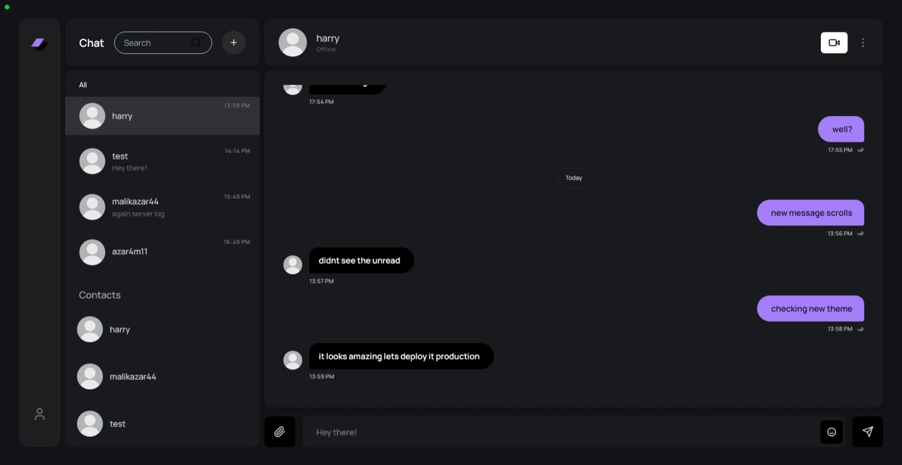

# Next.js Chat Application

This is a dynamic and feature-rich real-time chat application built using cutting-edge technologies including Next.js, Tailwind CSS, NextAuth, MongoDB, LiveKit, and Socket.IO.



## Note
The project URL may take a few minutes to load due to free-tier hosting limitations. We appreciate your patience.

## Features

- **Real-time Messaging**: Instantly send and receive messages with Socket.IO.
- **Add Users**: Seamlessly add other users using their login email addresses.
- **User Authentication**: Securely register and log in users with MongoDB and NextAuth.
- **Video Chat**: Enjoy face-to-face communication with built-in video chat powered by LiveKit.
- **One-on-One Conversations**: Engage in private chats with friends.
- **Rich Media Support**: Share images and emojis effortlessly within conversations.

## Built With

- [Next.js](https://nextjs.org/) - A powerful React framework for building web applications.
- [TailwindCSS](https://tailwindcss.com/) - A utility-first CSS framework for rapid UI development.
- [NextAuth](https://next-auth.js.org/) - Authentication for Next.js applications.
- [MongoDB](https://mongodb.com) - A scalable NoSQL database.
- [Socket.IO](https://socket.io/) - Real-time bidirectional communication.
- [LiveKit](https://livekit.io/) - A platform for scalable WebRTC video and audio communication.

## Getting Started

Follow these steps to get a copy of the project up and running on your local machine for development and testing:

### Installation

1. **Clone the Repository**:
   ```bash
   git clone https://github.com/muhammadxy/realtime-chat-app.git
   ```
2. **Install Dependencies**:
   ```bash
   npm install
   ```
3. **Start the Development Server**:
   ```bash
   npm run dev
   ```

## License

This project is licensed under the MIT License - see the [LICENSE.md](./LICENSE.md) file for details.

---

## Design Credit

The design for this project is inspired by [Desktop Design of a Chat Application -Lazarev]. All credit for the design goes to them.

---
